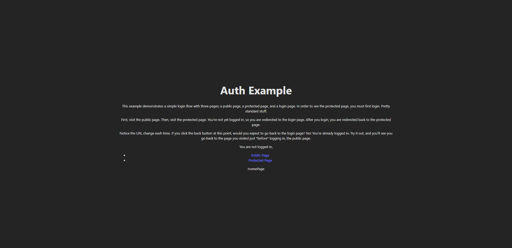
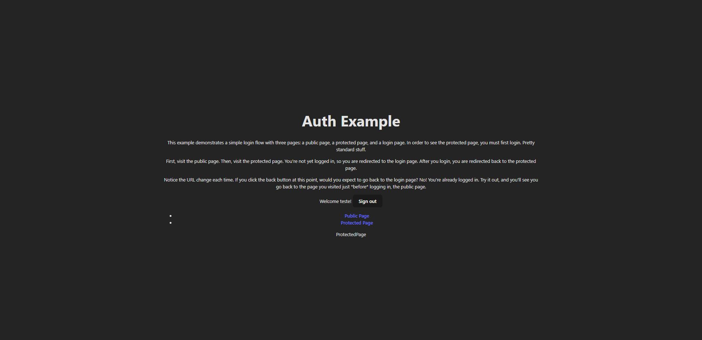

# protected-routes-typescript

Sistema básico de autenticação que não permite acessar páginas protegidas caso não esteja logado.

<h1>Home Page</h1>

Esta é a página inicial que mostra as opções de páginas possíveis

<h1>Login</h1>

Caso tente acessar a página protegida você será redirecionado para a página de login

Com o login feito você tem acesso a página protegida e a opção de realizar Sign out

